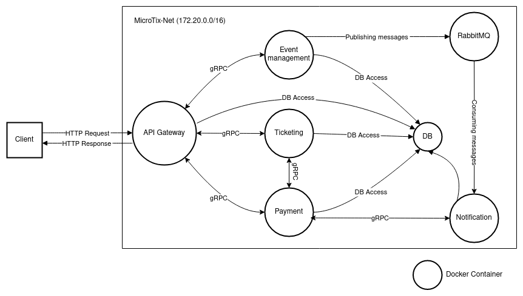

# MicroTix: A microserives-based event ticketing system

## Overview

This document provides an overview and documentation for MicroTix, a microservices-based event ticketing system.

### Services

- **API Gateway service:** Acts as the unified entry point for clients, responsible for user authentication and authorization, and routing requests to other services.
- **Event Management service:** Responsible for creating, updating, deleting events, and fetching event info.
- **Notification service:** Responsible for sending email notifications to users in response to various events.
- **Payment service:** Responsible for processing event fees.
- **Ticketing service:** Responsible for issuing event tickets.
- **RabbitMQ service:** Handles asynchronous communication.
- **Database service:** Storage place for various services' data.

## Implementation

The following sections describe some of the system implementation considerations.

### Containerization and Microservices

To ensure modularity, maintainability, and independence, Docker has been employed to containerize services, allowing each service to reside in its own container while all containers share the same network.

### gRPC and RoadRunner

For inter-service communication, we could use a typical REST API exposed by each service, but this introduces latency due to the large size of the JSON-encoded payload and the need to transmit typical HTTP headers with each request.

A better solution is to to use [gRPC](https://grpc.io), a high performace RPC protocol developed by Google. It uses binary-serialized data for transmission. [RoadRunner](https://roadrunner.dev), a high performance PHP application server, was utilized to enable gRPC support in PHP, as the official gRPC project does not support spinning up gRPC servers in PHP.

### Asynchronous Communication with RabbitMQ

While gRPC itself supports asynchronous communication, its PHP implementation does not. Therefore, [RabbitMQ](https://rabbitmq.net) was introduced to facilitate asynchronous communication. RabbitMQ follows the pub/sub model, allowing services to publish messages to a queue, and interested services can then subscribe and consume those messages.

RabbitMQ is used for sending email notifications to ticket owners whenever an update occurs on the event.

### Database Centralization vs. Distribution

Another consideration was whether to have a centralized MySQL instance or to follow a distributed model by having an instance running in each container. For the sake of data consistency, I have chosen to have a centralized instance shared among services. The decision to have a centralized MySQL instance introduces a single point of failure and may impact system performance.

## Container Orchestration

While this architecture can work well in a local development setting, it is highly advised to use container orchestration tools like Kubernetes when deploying to production. This eliminates the single point of failure by replicating the services among different nodes and handles the fluctuating demand of such systems by employing scalability and load balancing mechanisms.